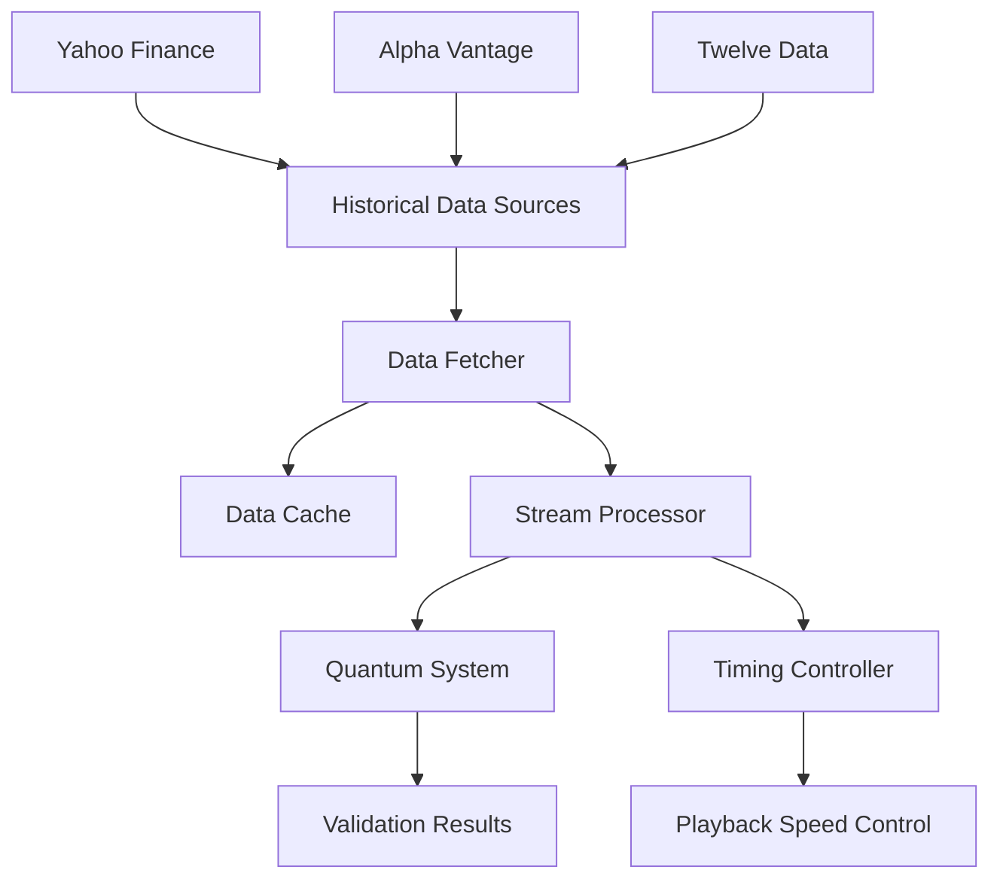

# ARES ChronoFabric Historical Market Data System

## Overview

The Historical Market Data System provides robust data fetching and streaming replay capabilities for validating quantum temporal correlation models with real market data. This system enables backtesting, model validation, and performance analysis using historical market data from multiple sources.

## Architecture



## Core Components

### 1. Historical Data Fetcher (`csf-core/src/data/historical_fetcher.rs`)

Primary component for fetching historical market data from multiple sources.

**Key Features:**
- Multi-source data fetching (Yahoo Finance, Alpha Vantage, Twelve Data)
- Configurable time intervals (1m to monthly)
- Automatic retry logic and rate limiting
- Response caching for performance
- Comprehensive error handling

### 2. Streaming Replay System

Converts historical data into real-time streams for model validation.

**Key Features:**
- Configurable playback speed (1x to any multiplier)
- Timing-accurate replay preserving original intervals
- Integration with existing streaming processor
- Compatible with quantum temporal correlation system

### 3. Data Integration Layer

Seamless integration with existing market data processing pipeline.

**Key Features:**
- Compatible with existing `MarketDataPoint` format
- Integration with quantum prediction system
- Support for multi-symbol parallel processing
- Validation workflow automation

## Data Sources

### Yahoo Finance (Recommended for Development)
- **Cost**: Free
- **Rate Limits**: Reasonable for development
- **Data Quality**: High
- **Coverage**: Global stocks, ETFs, forex, crypto
- **Intervals**: 1m, 2m, 5m, 15m, 30m, 1h, 1d, 1wk, 1mo
- **Historical Range**: Up to several years
- **Authentication**: None required

### Alpha Vantage (Recommended for Production)
- **Cost**: Free tier (500 calls/day), Premium ($99+/month)
- **Rate Limits**: 5 calls/minute (free), higher for premium
- **Data Quality**: Very High
- **Coverage**: Comprehensive global markets
- **Intervals**: 1m, 5m, 15m, 30m, 1h, daily, weekly, monthly
- **Historical Range**: 20+ years for daily, 2 years for intraday
- **Authentication**: API key required

### Twelve Data (Enterprise Option)
- **Cost**: Free tier (800 calls/day), Premium plans available
- **Rate Limits**: Variable by plan
- **Data Quality**: High
- **Coverage**: Global markets including emerging markets
- **Intervals**: 1m to monthly
- **Historical Range**: Extensive
- **Authentication**: API key required

## Configuration

### Basic Configuration

```rust
use csf_core::prelude::*;

let config = HistoricalDataConfig {
    data_source: DataSource::YahooFinance,
    symbols: vec!["AAPL".to_string(), "GOOGL".to_string(), "MSFT".to_string()],
    start_date: Utc::now() - Duration::days(30),
    end_date: Utc::now(),
    interval: TimeInterval::Daily,
    playbook_speed: 1.0, // Real-time
    max_retries: 3,
    rate_limit_ms: 1000, // 1 second between requests
};
```

### Advanced Configuration

```rust
// High-frequency data for detailed analysis
let hf_config = HistoricalDataConfig {
    data_source: DataSource::AlphaVantage { 
        api_key: "your_api_key".to_string() 
    },
    symbols: vec!["SPY".to_string()],
    start_date: Utc::now() - Duration::days(7),
    end_date: Utc::now(),
    interval: TimeInterval::OneMinute,
    playback_speed: 100.0, // 100x speed for backtesting
    max_retries: 5,
    rate_limit_ms: 12000, // 12 seconds (Alpha Vantage free tier limit)
};

// Multi-asset portfolio analysis
let portfolio_config = HistoricalDataConfig {
    data_source: DataSource::YahooFinance,
    symbols: vec![
        "AAPL".to_string(), "GOOGL".to_string(), "MSFT".to_string(),
        "TSLA".to_string(), "AMZN".to_string(), "META".to_string(),
        "SPY".to_string(), "QQQ".to_string(), "VTI".to_string(),
    ],
    start_date: Utc::now() - Duration::days(365), // 1 year
    end_date: Utc::now(),
    interval: TimeInterval::Daily,
    playback_speed: 50.0, // Accelerated backtesting
    max_retries: 3,
    rate_limit_ms: 500,
};
```

## Usage Examples

### 1. Basic Data Fetching

```rust
use csf_core::prelude::*;

#[tokio::main]
async fn main() -> Result<(), Box<dyn std::error::Error>> {
    // Create fetcher
    let mut fetcher = HistoricalDataFetcher::new(config);
    
    // Fetch all configured symbols
    let all_data = fetcher.fetch_all_data().await?;
    
    // Process each symbol
    for (symbol, data_points) in &all_data {
        println!("Symbol: {} has {} data points", symbol, data_points.len());
        
        // Analyze data
        let avg_volume = data_points.iter()
            .map(|p| p.volume)
            .sum::<f64>() / data_points.len() as f64;
        
        println!("Average volume: {:.0}", avg_volume);
    }
    
    Ok(())
}
```

### 2. Streaming Replay for Model Validation

```rust
use csf_core::prelude::*;

#[tokio::main]
async fn main() -> Result<(), Box<dyn std::error::Error>> {
    let mut fetcher = HistoricalDataFetcher::new(config);
    let symbol_data = fetcher.fetch_symbol_data("AAPL").await?;
    
    // Replay with timing control
    fetcher.replay_data_with_timing(symbol_data, |stream_data| {
        // Process each data point as it would arrive in real-time
        println!("Processing: {:?}", stream_data.timestamp);
        
        // Send to quantum temporal correlation system
        // process_quantum_data(stream_data);
    }).await?;
    
    Ok(())
}
```

### 3. Integration with Existing Market Data System

```rust
use csf_core::prelude::*;

#[tokio::main] 
async fn main() -> Result<(), Box<dyn std::error::Error>> {
    let mut fetcher = HistoricalDataFetcher::new(config);
    let historical_data = fetcher.fetch_symbol_data("AAPL").await?;
    
    // Convert to existing MarketDataPoint format
    let market_data: Vec<MarketDataPoint> = historical_data
        .into_iter()
        .map(|point| MarketDataPoint {
            timestamp: point.timestamp.timestamp_millis() as u64,
            symbol: point.symbol,
            open: point.open,
            high: point.high,
            low: point.low,
            close: point.close,
            volume: point.volume,
            bid: point.close - 0.01, // Simulate spread
            ask: point.close + 0.01,
        })
        .collect();
    
    // Process through quantum system
    let prediction = process_market_data(market_data).await?;
    println!("Prediction: ${:.2}", prediction.predicted_price);
    
    Ok(())
}
```

### 4. Batch Backtesting

```rust
use csf_core::prelude::*;

async fn backtest_strategy(
    symbols: Vec<String>,
    start_date: DateTime<Utc>,
    end_date: DateTime<Utc>
) -> Result<Vec<BacktestResult>, Box<dyn std::error::Error>> {
    let config = HistoricalDataConfig {
        data_source: DataSource::YahooFinance,
        symbols,
        start_date,
        end_date,
        interval: TimeInterval::Daily,
        playback_speed: 1000.0, // Very fast for backtesting
        max_retries: 3,
        rate_limit_ms: 100,
    };
    
    let mut fetcher = HistoricalDataFetcher::new(config);
    let all_data = fetcher.fetch_all_data().await?;
    
    let mut results = Vec::new();
    
    for (symbol, data) in all_data {
        let mut portfolio_value = 10000.0; // Start with $10k
        let mut predictions = Vec::new();
        
        // Process each data point
        for point in data {
            // Convert to market data format
            let market_point = MarketDataPoint {
                timestamp: point.timestamp.timestamp_millis() as u64,
                symbol: point.symbol.clone(),
                open: point.open,
                high: point.high,
                low: point.low,
                close: point.close,
                volume: point.volume,
                bid: point.close - 0.01,
                ask: point.close + 0.01,
            };
            
            // Generate prediction
            let prediction = process_market_data(vec![market_point]).await?;
            predictions.push(prediction);
            
            // Simulate trading based on prediction
            // (This would contain your actual trading logic)
        }
        
        results.push(BacktestResult {
            symbol,
            final_value: portfolio_value,
            predictions,
            // ... other metrics
        });
    }
    
    Ok(results)
}

struct BacktestResult {
    symbol: String,
    final_value: f64,
    predictions: Vec<MarketPrediction>,
}
```

## Performance Optimization

### 1. Caching Strategy

The system automatically caches fetched data to avoid redundant API calls:

```rust
// Data is automatically cached by symbol
let mut fetcher = HistoricalDataFetcher::new(config);

// First call hits the API
let data1 = fetcher.fetch_symbol_data("AAPL").await?;

// Second call uses cache
let data2 = fetcher.fetch_symbol_data("AAPL").await?; // Instant

// Clear cache if needed
fetcher.clear_cache();
```

### 2. Rate Limiting

Configure appropriate rate limits based on your data source:

```rust
let config = HistoricalDataConfig {
    // Yahoo Finance: ~100-200ms between requests
    rate_limit_ms: 200,
    
    // Alpha Vantage Free: 12 seconds between requests (5/minute)
    // rate_limit_ms: 12000,
    
    // Alpha Vantage Premium: Can be much lower
    // rate_limit_ms: 100,
    
    max_retries: 3, // Exponential backoff on failures
    ..config
};
```

### 3. Parallel Processing

For multiple symbols, the system fetches data sequentially to respect rate limits, but you can process the results in parallel:

```rust
use rayon::prelude::*;

let all_data = fetcher.fetch_all_data().await?;

// Process symbols in parallel
let results: Vec<_> = all_data
    .par_iter()
    .map(|(symbol, data)| {
        // Process each symbol's data in parallel
        process_symbol_data(symbol, data)
    })
    .collect();
```

## Error Handling

The system provides comprehensive error handling:

```rust
match fetcher.fetch_symbol_data("AAPL").await {
    Ok(data) => {
        println!("Successfully fetched {} data points", data.len());
    }
    Err(HistoricalDataError::NetworkError(msg)) => {
        eprintln!("Network error: {}", msg);
        // Retry logic or fallback to cached data
    }
    Err(HistoricalDataError::ApiError(msg)) => {
        eprintln!("API error: {}", msg);
        // Check API key, rate limits, symbol validity
    }
    Err(HistoricalDataError::NoDataFound(symbol)) => {
        eprintln!("No data found for symbol: {}", symbol);
        // Handle missing data gracefully
    }
    Err(e) => {
        eprintln!("Other error: {}", e);
    }
}
```

## Integration Points

### 1. Quantum Temporal Correlation System

The historical data integrates seamlessly with your quantum system:

```rust
// historical_fetcher.rs:312 - Creates StreamData compatible format
let stream_data = StreamData {
    stream_id: uuid::Uuid::new_v4(),
    sequence_number: index as u64,
    timestamp: point.timestamp,
    data_type: DataType::PhaseSpaceTrajectory,
    payload: DataPayload::Points {
        points: vec![vec![
            point.open, point.high, point.low, point.close, point.volume
        ]],
        dimension: 5,
    },
    metadata,
};
```

### 2. Existing Market Data Pipeline

Direct compatibility with `market_data_integration.rs:44`:

```rust
// Convert HistoricalDataPoint to MarketDataPoint
let market_point = MarketDataPoint {
    timestamp: historical_point.timestamp.timestamp_millis() as u64,
    symbol: historical_point.symbol,
    open: historical_point.open,
    high: historical_point.high,
    low: historical_point.low,
    close: historical_point.close,
    volume: historical_point.volume,
    bid: historical_point.close - 0.01,
    ask: historical_point.close + 0.01,
};
```

### 3. Streaming Processor Integration

Works with `streaming_processor.rs:25`:

```rust
// Create input stream for historical replay
let stream_config = StreamInputConfig {
    data_type: DataType::PhaseSpaceTrajectory,
    expected_rate_pps: 1000.0, // Adjust based on playback speed
    buffer_size: Some(4096),
};

let stream_id = processor.create_input_stream(stream_config).await?;
```

## Validation Workflows

### 1. Model Accuracy Validation

```rust
async fn validate_model_accuracy() -> Result<ValidationReport, Box<dyn std::error::Error>> {
    let config = HistoricalDataConfig {
        symbols: vec!["AAPL".to_string()],
        start_date: Utc::now() - Duration::days(90),
        end_date: Utc::now() - Duration::days(30), // Use recent history for validation
        interval: TimeInterval::Daily,
        playback_speed: 1000.0,
        ..Default::default()
    };
    
    let mut fetcher = HistoricalDataFetcher::new(config);
    let validation_data = fetcher.fetch_symbol_data("AAPL").await?;
    
    let mut correct_predictions = 0;
    let mut total_predictions = 0;
    
    for point in validation_data {
        // Generate prediction based on historical data up to this point
        let prediction = generate_prediction(&point).await?;
        
        // Compare with actual next-day price (known from historical data)
        if prediction_matches_reality(&prediction, &point) {
            correct_predictions += 1;
        }
        total_predictions += 1;
    }
    
    Ok(ValidationReport {
        accuracy: correct_predictions as f64 / total_predictions as f64,
        total_predictions,
        symbol: "AAPL".to_string(),
    })
}
```

### 2. Performance Benchmarking

```rust
async fn benchmark_system_performance() -> Result<PerformanceReport, Box<dyn std::error::Error>> {
    let start_time = Instant::now();
    
    let config = HistoricalDataConfig {
        symbols: vec!["AAPL".to_string(), "GOOGL".to_string(), "MSFT".to_string()],
        start_date: Utc::now() - Duration::days(365),
        end_date: Utc::now(),
        interval: TimeInterval::Daily,
        playback_speed: 1000.0, // Process 1000x faster than real-time
        ..Default::default()
    };
    
    let mut fetcher = HistoricalDataFetcher::new(config);
    let all_data = fetcher.fetch_all_data().await?;
    
    let mut total_points_processed = 0;
    let processing_start = Instant::now();
    
    for (symbol, data) in all_data {
        for point in data {
            // Process through quantum system
            let _prediction = process_quantum_data(point).await?;
            total_points_processed += 1;
        }
    }
    
    let total_duration = start_time.elapsed();
    let processing_duration = processing_start.elapsed();
    
    Ok(PerformanceReport {
        total_duration,
        processing_duration,
        points_processed: total_points_processed,
        points_per_second: total_points_processed as f64 / processing_duration.as_secs_f64(),
        data_fetch_time: processing_start.duration_since(start_time),
    })
}
```

## Troubleshooting Guide

### Common Issues and Solutions

#### 1. Network Timeouts
**Symptom**: `NetworkError` with timeout messages
**Solutions**:
- Increase `rate_limit_ms` in configuration
- Check internet connection stability
- Use retry logic with exponential backoff
- Switch to alternative data source

#### 2. API Rate Limits Exceeded
**Symptom**: `ApiError` mentioning rate limits
**Solutions**:
- Increase `rate_limit_ms` significantly
- Reduce the number of symbols per batch
- Use shorter time ranges
- Upgrade to premium API plan
- Implement intelligent caching

#### 3. No Data Found for Symbol
**Symptom**: `NoDataFound` error
**Solutions**:
- Verify symbol format (e.g., "AAPL" vs "AAPL.US")
- Check if symbol exists on the exchange
- Try different data source
- Verify date range is valid for the symbol

#### 4. Invalid Date Range
**Symptom**: Empty response or API errors
**Solutions**:
- Ensure start_date < end_date
- Check if date range is supported by data source
- Be aware of market holidays and weekends
- Use appropriate intervals for date range

#### 5. Memory Issues with Large Datasets
**Symptom**: Out of memory errors
**Solutions**:
- Process data in smaller time chunks
- Implement streaming processing instead of batch loading
- Reduce the number of symbols processed simultaneously
- Use data compression features

#### 6. Integration Compilation Errors
**Symptom**: Cannot compile due to missing dependencies
**Solutions**:
- Ensure `reqwest` and `futures` dependencies are added to Cargo.toml
- Update dependency versions if needed
- Check for circular dependency issues
- Verify all required features are enabled

### Debug Configuration

Enable debug logging for troubleshooting:

```rust
use tracing::{info, debug, error};

let config = HistoricalDataConfig {
    // ... your config
};

// Enable detailed logging
env_logger::init();

let mut fetcher = HistoricalDataFetcher::new(config);

match fetcher.fetch_symbol_data("AAPL").await {
    Ok(data) => {
        info!("Successfully fetched {} data points", data.len());
        debug!("Data range: {} to {}", 
            data.first().map(|p| p.timestamp.to_string()).unwrap_or_default(),
            data.last().map(|p| p.timestamp.to_string()).unwrap_or_default()
        );
    }
    Err(e) => {
        error!("Failed to fetch data: {:?}", e);
    }
}
```

### Performance Monitoring

Monitor system performance during data processing:

```rust
use std::time::Instant;

let start = Instant::now();
let data = fetcher.fetch_all_data().await?;
let fetch_duration = start.elapsed();

println!("Data fetching took: {:?}", fetch_duration);
println!("Average per symbol: {:?}", fetch_duration / data.len() as u32);

// Monitor memory usage
let memory_usage = std::process::Command::new("ps")
    .args(&["-o", "rss=", "-p", &std::process::id().to_string()])
    .output()
    .map(|output| String::from_utf8_lossy(&output.stdout).trim().to_string())
    .unwrap_or_else(|_| "unknown".to_string());

println!("Memory usage: {} KB", memory_usage);
```

## Security Considerations

### API Key Management

Store API keys securely:

```rust
use std::env;

// Never hardcode API keys in source code
let api_key = env::var("ALPHA_VANTAGE_API_KEY")
    .expect("ALPHA_VANTAGE_API_KEY environment variable not set");

let config = HistoricalDataConfig {
    data_source: DataSource::AlphaVantage { api_key },
    // ... rest of config
};
```

### Data Validation

Always validate fetched data:

```rust
fn validate_market_data(data: &HistoricalDataPoint) -> bool {
    // Basic sanity checks
    data.open > 0.0 
        && data.high > 0.0 
        && data.low > 0.0 
        && data.close > 0.0
        && data.volume >= 0.0
        && data.high >= data.low
        && data.high >= data.open.max(data.close)
        && data.low <= data.open.min(data.close)
}
```

## Future Enhancements

### Planned Features
1. **Real-time Data Integration**: Seamless transition from historical to live data
2. **Advanced Caching**: Persistent disk cache with compression
3. **Data Quality Metrics**: Automatic data quality assessment
4. **Multi-timeframe Synchronization**: Align data across different intervals
5. **Custom Data Sources**: Plugin architecture for additional data providers
6. **Distributed Fetching**: Parallel data fetching across multiple sources

### Extension Points
- Custom data transformations
- Additional data sources (IEX Cloud, Polygon, Quandl)
- Real-time data streaming integration
- Advanced error recovery strategies
- Performance optimization plugins

---

**Author**: Ididia Serfaty  
**Contact**: IS@delfictus.com  
**Project**: ARES ChronoFabric System