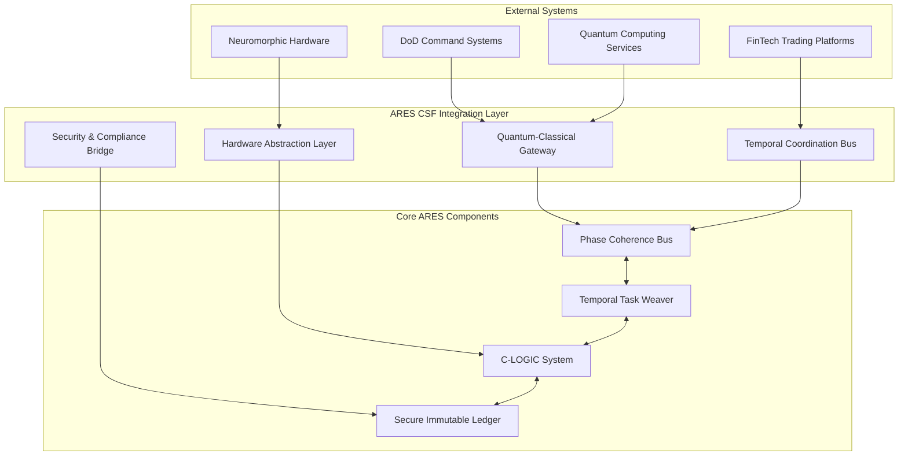

# ARES CSF Integration Strategy & Architecture Plan

**Session ID**: 1756029089366134570  
**Integration Target**: Multi-service quantum-temporal computing platform  
**Architecture Pattern**: Event-driven microservices with quantum-classical coordination  

## Integration Architecture Overview

The ARES CSF platform requires a sophisticated integration strategy combining **synchronous quantum-temporal operations** with **asynchronous distributed coordination**. The system implements a novel **temporal-coherent integration pattern** unique to quantum-classical hybrid systems.



## Integration Patterns by Service Type

### 1. Quantum-Classical Integration Pattern

**Use Case**: Integration with quantum computing services (IBM Quantum, IonQ, Rigetti)

```rust
// quantum-integration.rs
use csf_time::QuantumOracle;
use csf_mlir::QuantumDialect;

pub struct QuantumIntegration {
    classical_scheduler: Arc<TemporalTaskWeaver>,
    quantum_backend: Box<dyn QuantumBackend>,
    coherence_manager: PhaseCoherenceManager,
}

impl QuantumIntegration {
    pub async fn execute_hybrid_workflow(&self, workflow: HybridWorkflow) -> Result<WorkflowResult> {
        // Phase 1: Classical preparation with temporal coordination
        let classical_context = self.classical_scheduler
            .prepare_quantum_context(workflow.classical_setup).await?;
        
        // Phase 2: Quantum execution with decoherence monitoring  
        let quantum_result = self.quantum_backend
            .execute_quantum_circuit(
                workflow.quantum_circuit,
                classical_context.parameters,
                Duration::from_micros(workflow.coherence_time_us)
            ).await?;
        
        // Phase 3: Classical post-processing with temporal consistency
        let final_result = self.classical_scheduler
            .process_quantum_result(quantum_result, classical_context).await?;
            
        // Phase 4: Update temporal coherence state
        self.coherence_manager
            .update_quantum_classical_state(final_result.coherence_data).await?;
            
        Ok(final_result)
    }
}

// Quantum backend abstraction
#[async_trait]
pub trait QuantumBackend: Send + Sync {
    async fn execute_quantum_circuit(
        &self,
        circuit: QuantumCircuit,
        parameters: ClassicalParameters,
        coherence_timeout: Duration
    ) -> Result<QuantumResult>;
    
    async fn check_device_availability(&self) -> Result<DeviceStatus>;
    async fn estimate_execution_time(&self, circuit: &QuantumCircuit) -> Result<Duration>;
}

// IBM Quantum implementation
pub struct IBMQuantumBackend {
    client: IBMQuantumClient,
    device_name: String,
    auth_token: SecretString,
}

impl QuantumBackend for IBMQuantumBackend {
    async fn execute_quantum_circuit(
        &self,
        circuit: QuantumCircuit,
        parameters: ClassicalParameters,
        coherence_timeout: Duration
    ) -> Result<QuantumResult> {
        // Convert ARES circuit to QASM
        let qasm_code = self.convert_to_qasm(&circuit)?;
        
        // Submit job with timeout management
        let job = self.client.submit_job(JobRequest {
            qasm_code,
            device: self.device_name.clone(),
            shots: parameters.shots,
            timeout: coherence_timeout,
        }).await?;
        
        // Monitor job with coherence deadline
        let result = self.client.wait_for_completion(
            job.id, 
            coherence_timeout
        ).await?;
        
        // Convert results back to ARES format
        Ok(QuantumResult {
            measurements: result.measurements,
            coherence_preserved: result.execution_time < coherence_timeout,
            fidelity: result.fidelity,
            timestamp: Instant::now(),
        })
    }
}
```

### 2. DoD Command & Control Integration

**Use Case**: Integration with military command systems and secure networks

```rust
// dod-integration.rs
use csf_sil::SecureImmutableLedger;
use csf_network::SecureTransport;

pub struct DoDIntegration {
    secure_transport: SecureTransport,
    audit_ledger: SecureImmutableLedger,
    command_processor: CommandProcessor,
    clearance_validator: SecurityClearanceValidator,
}

impl DoDIntegration {
    pub async fn handle_classified_command(&self, command: ClassifiedCommand) -> Result<CommandResponse> {
        // Security validation with audit trail
        let validation_result = self.clearance_validator
            .validate_command_authority(&command).await?;
        
        self.audit_ledger.record_command_attempt(
            &command,
            &validation_result,
            SystemTime::now()
        ).await?;
        
        if !validation_result.authorized {
            return Err(CommandError::InsufficientClearance);
        }
        
        // Temporal command scheduling with causality preservation
        let scheduled_execution = self.command_processor
            .schedule_command_with_causality(
                command.clone(),
                validation_result.execution_context
            ).await?;
        
        // Execute with real-time monitoring
        let execution_result = self.execute_secured_command(
            scheduled_execution,
            validation_result.security_context
        ).await?;
        
        // Record execution in immutable audit trail
        self.audit_ledger.record_command_execution(
            &command,
            &execution_result,
            SystemTime::now()
        ).await?;
        
        Ok(CommandResponse {
            command_id: command.id,
            execution_status: execution_result.status,
            classification_level: command.classification,
            audit_record_id: execution_result.audit_id,
        })
    }
    
    async fn execute_secured_command(
        &self,
        scheduled_command: ScheduledCommand,
        security_context: SecurityContext
    ) -> Result<ExecutionResult> {
        // Implementation with temporal guarantees and security controls
        todo!("Implement secure command execution with temporal coordination")
    }
}

// Security clearance validation
pub struct SecurityClearanceValidator {
    clearance_database: Arc<ClearanceDatabase>,
    policy_engine: PolicyEngine,
}

impl SecurityClearanceValidator {
    async fn validate_command_authority(&self, command: &ClassifiedCommand) -> Result<ValidationResult> {
        // Multi-factor validation with temporal consistency
        let user_clearance = self.clearance_database
            .get_current_clearance(&command.user_id).await?;
            
        let command_requirements = self.policy_engine
            .get_command_requirements(&command.command_type).await?;
            
        let temporal_authorization = self.validate_temporal_authority(
            &command.temporal_constraints,
            &user_clearance.time_based_restrictions
        ).await?;
        
        Ok(ValidationResult {
            authorized: user_clearance.level >= command_requirements.min_level &&
                       temporal_authorization.valid,
            execution_context: ExecutionContext::new(user_clearance, command_requirements),
            security_context: SecurityContext::new(command.classification),
        })
    }
}
```

### 3. High-Frequency Trading Integration

**Use Case**: Ultra-low latency integration with trading systems

```rust
// trading-integration.rs
use csf_bus::PhaseCoherenceBus;
use csf_time::HybridLogicalClock;

pub struct TradingIntegration {
    market_data_bus: Arc<PhaseCoherenceBus>,
    order_execution_engine: OrderExecutionEngine,
    risk_manager: RiskManager,
    temporal_coordinator: HybridLogicalClock,
}

impl TradingIntegration {
    pub async fn process_trading_signal(&self, signal: TradingSignal) -> Result<ExecutionResult> {
        let processing_start = self.temporal_coordinator.now();
        
        // Sub-microsecond market data processing
        let market_context = self.market_data_bus
            .get_latest_market_state(signal.symbols.clone())
            .await?;
            
        // Risk assessment with temporal coherence
        let risk_assessment = self.risk_manager
            .assess_risk_with_temporal_context(
                &signal,
                &market_context,
                processing_start
            ).await?;
            
        if !risk_assessment.approved {
            return Ok(ExecutionResult::RiskRejected(risk_assessment.reason));
        }
        
        // Order execution with causality preservation
        let execution_result = self.order_execution_engine
            .execute_order_with_causality(
                signal.into_order(),
                risk_assessment.approved_parameters,
                processing_start
            ).await?;
            
        // Verify temporal consistency
        let processing_end = self.temporal_coordinator.now();
        let total_latency = processing_end.duration_since(processing_start);
        
        if total_latency > Duration::from_micros(1) {
            self.emit_latency_alert(total_latency).await?;
        }
        
        Ok(ExecutionResult::Executed {
            order_id: execution_result.order_id,
            execution_price: execution_result.price,
            total_latency_us: total_latency.as_micros() as u64,
            causality_preserved: execution_result.causality_consistent,
        })
    }
}

// Ultra-low latency order execution
pub struct OrderExecutionEngine {
    venue_connections: HashMap<VenueId, VenueConnection>,
    execution_coordinator: ExecutionCoordinator,
}

impl OrderExecutionEngine {
    async fn execute_order_with_causality(
        &self,
        order: Order,
        risk_params: RiskParameters,
        causality_timestamp: HLCTimestamp
    ) -> Result<ExecutionDetails> {
        // Route to optimal venue with sub-microsecond latency
        let venue = self.select_optimal_venue(&order).await?;
        let connection = self.venue_connections.get(&venue)
            .ok_or(ExecutionError::VenueUnavailable)?;
        
        // Execute with hardware timestamping
        let execution_start = hardware_timestamp();
        let execution_result = connection
            .submit_order_with_timestamp(order, causality_timestamp)
            .await?;
        let execution_end = hardware_timestamp();
        
        // Validate causality and temporal consistency
        self.execution_coordinator.validate_execution_causality(
            causality_timestamp,
            execution_start,
            execution_result.venue_timestamp
        )?;
        
        Ok(ExecutionDetails {
            order_id: execution_result.order_id,
            price: execution_result.price,
            venue_latency: execution_end - execution_start,
            causality_consistent: true,
            venue_timestamp: execution_result.venue_timestamp,
        })
    }
}

#[inline(always)]
fn hardware_timestamp() -> Instant {
    // Platform-specific hardware timestamp access
    #[cfg(target_arch = "x86_64")]
    {
        use std::arch::x86_64::_rdtsc;
        unsafe { Instant::from_nanos(_rdtsc()) }
    }
    #[cfg(not(target_arch = "x86_64"))]
    {
        Instant::now()
    }
}
```

### 4. Neuromorphic Hardware Integration

**Use Case**: Integration with Intel Loihi, SpiNNaker, and other neuromorphic processors

```rust
// neuromorphic-integration.rs
use csf_hardware::NeuromorphicDevice;
use csf_clogic::drpp::DynamicResonancePatternProcessor;

pub struct NeuromorphicIntegration {
    device_manager: NeuromorphicDeviceManager,
    pattern_processor: Arc<DynamicResonancePatternProcessor>,
    spike_encoder: SpikeEncoder,
    learning_coordinator: LearningCoordinator,
}

impl NeuromorphicIntegration {
    pub async fn process_sensory_data(&self, data: SensoryData) -> Result<ProcessingResult> {
        // Encode classical data to spike trains
        let spike_trains = self.spike_encoder
            .encode_to_spikes(data.clone())
            .await?;
        
        // Distribute processing across available neuromorphic devices
        let device_assignments = self.device_manager
            .assign_processing_load(&spike_trains)
            .await?;
        
        let mut processing_futures = Vec::new();
        
        for (device_id, spike_subset) in device_assignments {
            let device = self.device_manager.get_device(&device_id)?;
            let processor = self.pattern_processor.clone();
            
            let future = tokio::spawn(async move {
                // Process on neuromorphic hardware
                let spike_output = device.process_spikes(spike_subset).await?;
                
                // Pattern analysis with ARES C-LOGIC
                let patterns = processor.analyze_spike_patterns(spike_output).await?;
                
                Ok((device_id, patterns))
            });
            
            processing_futures.push(future);
        }
        
        // Collect and merge results from all devices
        let mut merged_patterns = PatternSet::new();
        
        for future in processing_futures {
            let (device_id, patterns) = future.await??;
            merged_patterns.merge_device_patterns(device_id, patterns);
        }
        
        // Apply learning updates across the network
        self.learning_coordinator
            .update_network_weights(&data, &merged_patterns)
            .await?;
        
        Ok(ProcessingResult {
            detected_patterns: merged_patterns,
            processing_latency: data.timestamp.elapsed(),
            devices_used: device_assignments.len(),
            learning_applied: true,
        })
    }
}

// Neuromorphic device management
pub struct NeuromorphicDeviceManager {
    loihi_devices: Vec<LoihiDevice>,
    spinnaker_devices: Vec<SpiNNakerDevice>,
    device_scheduler: DeviceScheduler,
}

impl NeuromorphicDeviceManager {
    async fn assign_processing_load(&self, spike_trains: &[SpikeTrain]) -> Result<Vec<(DeviceId, Vec<SpikeTrain>)>> {
        let mut assignments = Vec::new();
        
        // Load balance based on device capabilities and current utilization
        for spike_train in spike_trains.chunks(1000) {
            let optimal_device = self.device_scheduler
                .select_optimal_device(spike_train.len())
                .await?;
            
            assignments.push((optimal_device, spike_train.to_vec()));
        }
        
        Ok(assignments)
    }
    
    fn get_device(&self, device_id: &DeviceId) -> Result<&dyn NeuromorphicDevice> {
        match device_id.device_type {
            DeviceType::Loihi => {
                self.loihi_devices
                    .get(device_id.index)
                    .map(|d| d as &dyn NeuromorphicDevice)
                    .ok_or(IntegrationError::DeviceNotFound)
            },
            DeviceType::SpiNNaker => {
                self.spinnaker_devices
                    .get(device_id.index)
                    .map(|d| d as &dyn NeuromorphicDevice)
                    .ok_or(IntegrationError::DeviceNotFound)
            }
        }
    }
}

// Intel Loihi device interface
pub struct LoihiDevice {
    device_handle: LoihiHandle,
    core_utilization: AtomicU64,
    spike_buffer: Arc<Mutex<SpikeBuffer>>,
}

#[async_trait]
impl NeuromorphicDevice for LoihiDevice {
    async fn process_spikes(&self, spikes: Vec<SpikeTrain>) -> Result<SpikeOutput> {
        // Load spikes onto Loihi cores
        let spike_data = self.prepare_spike_data(&spikes)?;
        
        // Execute neuromorphic processing
        let processing_result = self.device_handle
            .execute_spike_processing(spike_data)
            .await?;
        
        // Extract output spikes
        Ok(SpikeOutput {
            output_spikes: processing_result.output_spikes,
            processing_time: processing_result.execution_time,
            core_utilization: processing_result.core_usage,
            energy_consumed: processing_result.energy_nj,
        })
    }
    
    async fn configure_network(&self, topology: NetworkTopology) -> Result<()> {
        // Configure Loihi network topology
        self.device_handle.configure_cores(&topology.core_config).await?;
        self.device_handle.configure_synapses(&topology.synapse_config).await?;
        Ok(())
    }
}
```

## Service Orchestration Strategy

### Temporal Coordination Architecture

```rust
// orchestration.rs
use csf_runtime::Orchestrator;

pub struct TemporalOrchestrator {
    service_registry: ServiceRegistry,
    temporal_coordinator: Arc<HybridLogicalClock>,
    causality_tracker: CausalityTracker,
    workflow_engine: WorkflowEngine,
}

impl TemporalOrchestrator {
    pub async fn execute_distributed_workflow(&self, workflow: DistributedWorkflow) -> Result<WorkflowResult> {
        // Phase 1: Temporal consistency check
        let causality_constraints = self.causality_tracker
            .analyze_workflow_causality(&workflow).await?;
        
        // Phase 2: Service capability matching
        let service_assignments = self.service_registry
            .match_services_to_workflow_steps(
                &workflow,
                &causality_constraints
            ).await?;
        
        // Phase 3: Coordinated execution with temporal synchronization
        let execution_context = ExecutionContext::new(
            workflow.id.clone(),
            self.temporal_coordinator.now(),
            causality_constraints,
        );
        
        let workflow_result = self.workflow_engine
            .execute_with_temporal_coordination(
                workflow,
                service_assignments,
                execution_context
            ).await?;
        
        // Phase 4: Causality validation
        self.causality_tracker
            .validate_execution_causality(&workflow_result).await?;
        
        Ok(workflow_result)
    }
}

// Service registry with capability matching
pub struct ServiceRegistry {
    registered_services: Arc<RwLock<HashMap<ServiceId, ServiceCapabilities>>>,
    health_monitor: HealthMonitor,
    load_balancer: LoadBalancer,
}

impl ServiceRegistry {
    async fn match_services_to_workflow_steps(
        &self,
        workflow: &DistributedWorkflow,
        causality_constraints: &CausalityConstraints
    ) -> Result<Vec<ServiceAssignment>> {
        let services = self.registered_services.read().await;
        let mut assignments = Vec::new();
        
        for step in &workflow.steps {
            // Find services capable of executing this step
            let capable_services: Vec<_> = services
                .iter()
                .filter(|(_, capabilities)| {
                    capabilities.can_execute(&step.operation_type) &&
                    capabilities.meets_temporal_requirements(&step.timing_requirements)
                })
                .collect();
            
            if capable_services.is_empty() {
                return Err(OrchestrationError::NoCapableService(step.id.clone()));
            }
            
            // Select optimal service based on current load and causality requirements
            let selected_service = self.select_optimal_service(
                &capable_services,
                &step,
                &causality_constraints
            ).await?;
            
            assignments.push(ServiceAssignment {
                step_id: step.id.clone(),
                service_id: selected_service.0.clone(),
                execution_requirements: ExecutionRequirements {
                    temporal_constraints: step.timing_requirements.clone(),
                    resource_requirements: step.resource_requirements.clone(),
                    causality_dependencies: causality_constraints
                        .get_dependencies(&step.id)
                        .cloned()
                        .unwrap_or_default(),
                },
            });
        }
        
        Ok(assignments)
    }
}
```

## Authentication & Authorization Integration

### Multi-Domain Security Integration

```rust
// security-integration.rs
use csf_sil::CryptographicLedger;

pub struct SecurityIntegration {
    identity_providers: HashMap<Domain, Box<dyn IdentityProvider>>,
    policy_engine: PolicyEngine,
    audit_ledger: Arc<CryptographicLedger>,
    token_validator: TokenValidator,
}

impl SecurityIntegration {
    pub async fn authenticate_cross_domain_request(&self, request: CrossDomainRequest) -> Result<AuthenticationResult> {
        // Multi-domain authentication
        let primary_identity = self.authenticate_primary_domain(&request).await?;
        let secondary_identities = self.authenticate_secondary_domains(&request).await?;
        
        // Combined identity validation
        let combined_identity = CombinedIdentity::new(
            primary_identity,
            secondary_identities
        );
        
        // Policy evaluation with temporal context
        let authorization = self.policy_engine
            .evaluate_authorization(
                &combined_identity,
                &request.operation,
                request.temporal_context.clone()
            ).await?;
        
        // Audit trail creation
        self.audit_ledger
            .record_authentication_event(
                &combined_identity,
                &authorization,
                SystemTime::now()
            ).await?;
        
        Ok(AuthenticationResult {
            identity: combined_identity,
            authorization,
            audit_record_id: self.audit_ledger.latest_record_id(),
            valid_until: authorization.expiration_time,
        })
    }
    
    async fn authenticate_primary_domain(&self, request: &CrossDomainRequest) -> Result<Identity> {
        let provider = self.identity_providers
            .get(&request.primary_domain)
            .ok_or(SecurityError::UnsupportedDomain)?;
        
        provider.authenticate(request.credentials.clone()).await
    }
}

// OAuth2/OIDC integration for multiple domains
pub struct OAuthProvider {
    client_config: OAuth2Config,
    token_cache: Arc<Mutex<TokenCache>>,
    discovery_document: DiscoveryDocument,
}

#[async_trait]
impl IdentityProvider for OAuthProvider {
    async fn authenticate(&self, credentials: Credentials) -> Result<Identity> {
        match credentials {
            Credentials::BearerToken(token) => {
                self.validate_bearer_token(token).await
            },
            Credentials::AuthorizationCode { code, redirect_uri } => {
                self.exchange_authorization_code(code, redirect_uri).await
            },
            _ => Err(SecurityError::UnsupportedCredentialType)
        }
    }
    
    async fn refresh_token(&self, refresh_token: RefreshToken) -> Result<TokenResponse> {
        let token_request = TokenRequest {
            grant_type: "refresh_token".to_string(),
            refresh_token: refresh_token.value,
            client_id: self.client_config.client_id.clone(),
            client_secret: Some(self.client_config.client_secret.clone()),
        };
        
        let response = self.client_config.http_client
            .post(&self.discovery_document.token_endpoint)
            .json(&token_request)
            .send()
            .await?;
        
        let token_response: TokenResponse = response.json().await?;
        
        // Cache the new token
        self.token_cache.lock().await.insert(
            token_response.access_token.clone(),
            token_response.expires_in
        );
        
        Ok(token_response)
    }
}
```

## Monitoring & Observability Integration

### Comprehensive Observability Strategy

```rust
// observability-integration.rs
use csf_telemetry::TelemetryCollector;
use opentelemetry::{trace::Tracer, metrics::Meter};

pub struct ObservabilityIntegration {
    tracer: Box<dyn Tracer>,
    meter: Box<dyn Meter>,
    log_aggregator: LogAggregator,
    alert_manager: AlertManager,
    dashboard_generator: DashboardGenerator,
}

impl ObservabilityIntegration {
    pub fn instrument_integration<T, F>(&self, name: &str, operation: F) -> impl Future<Output = Result<T>>
    where
        F: Future<Output = Result<T>>,
    {
        let span = self.tracer.start(format!("integration.{}", name));
        let start_time = Instant::now();
        let counter = self.meter.u64_counter(format!("integration.{}.calls", name));
        let histogram = self.meter.f64_histogram(format!("integration.{}.duration", name));
        
        async move {
            counter.add(1, &[]);
            
            let result = operation.await;
            
            let duration = start_time.elapsed();
            histogram.record(duration.as_secs_f64(), &[]);
            
            match &result {
                Ok(_) => {
                    span.set_attribute("result", "success");
                    self.meter.u64_counter(format!("integration.{}.success", name))
                        .add(1, &[]);
                },
                Err(err) => {
                    span.set_attribute("result", "error");
                    span.set_attribute("error", format!("{:?}", err));
                    self.meter.u64_counter(format!("integration.{}.errors", name))
                        .add(1, &[]);
                }
            }
            
            span.end();
            result
        }
    }
    
    pub async fn generate_integration_dashboard(&self) -> Result<Dashboard> {
        let metrics = self.collect_integration_metrics().await?;
        
        self.dashboard_generator.create_dashboard(DashboardConfig {
            title: "ARES CSF Integration Monitoring",
            panels: vec![
                Panel::new_graph("Integration Latency")
                    .with_metric("integration.*.duration")
                    .with_threshold(Duration::from_micros(1000), AlertLevel::Warning),
                    
                Panel::new_counter("Integration Success Rate")
                    .with_metric("integration.*.success")
                    .with_metric("integration.*.errors")
                    .with_threshold(0.95, AlertLevel::Critical),
                    
                Panel::new_heatmap("Service Dependencies")
                    .with_metric("integration.service.dependencies")
                    .with_grouping("service_type"),
                    
                Panel::new_table("Current Integrations")
                    .with_columns(vec!["Service", "Status", "Last Success", "Error Rate"])
                    .with_data_source("integration.status"),
            ],
            refresh_interval: Duration::from_secs(30),
            alert_rules: self.generate_alert_rules().await?,
        }).await
    }
}

// Integration health monitoring
pub struct IntegrationHealthMonitor {
    health_checks: HashMap<IntegrationId, Box<dyn HealthCheck>>,
    status_cache: Arc<RwLock<HashMap<IntegrationId, HealthStatus>>>,
    notification_service: NotificationService,
}

impl IntegrationHealthMonitor {
    pub async fn start_monitoring(&self, check_interval: Duration) {
        let mut interval = tokio::time::interval(check_interval);
        
        loop {
            interval.tick().await;
            
            let health_futures: Vec<_> = self.health_checks
                .iter()
                .map(|(integration_id, health_check)| {
                    let integration_id = integration_id.clone();
                    let health_check = health_check.clone();
                    
                    async move {
                        let start_time = Instant::now();
                        let health_result = health_check.check_health().await;
                        let check_duration = start_time.elapsed();
                        
                        (integration_id, HealthStatus {
                            status: match health_result {
                                Ok(_) => ServiceStatus::Healthy,
                                Err(err) if err.is_recoverable() => ServiceStatus::Degraded,
                                Err(_) => ServiceStatus::Unhealthy,
                            },
                            last_check: SystemTime::now(),
                            response_time: check_duration,
                            details: health_result.map(|_| "OK".to_string())
                                .unwrap_or_else(|e| format!("Error: {}", e)),
                        })
                    }
                })
                .collect();
            
            let health_results = futures::future::join_all(health_futures).await;
            
            // Update status cache and trigger alerts for status changes
            let mut status_cache = self.status_cache.write().await;
            
            for (integration_id, new_status) in health_results {
                let previous_status = status_cache.get(&integration_id);
                
                if let Some(prev) = previous_status {
                    if prev.status != new_status.status {
                        // Status change detected - send alert
                        self.notification_service
                            .send_status_change_alert(
                                &integration_id,
                                prev.status,
                                new_status.status
                            ).await.ok(); // Don't fail monitoring on notification errors
                    }
                }
                
                status_cache.insert(integration_id, new_status);
            }
        }
    }
}
```

## Production Deployment Configuration

### Multi-Environment Deployment Strategy

```yaml
# deployment-config.yml
environments:
  development:
    integration_endpoints:
      quantum_backend: "simulator://localhost:8080"
      neuromorphic_devices: "mock://devices"
      security_provider: "test://auth"
    
    performance_requirements:
      max_latency_us: 10
      min_throughput_msg_per_sec: 10000
      
    monitoring:
      log_level: "debug"
      metrics_collection_interval_ms: 1000
      distributed_tracing: true

  staging:
    integration_endpoints:
      quantum_backend: "ibm://quantum-staging.ibm.com"
      neuromorphic_devices: "loihi://staging-cluster"
      security_provider: "oauth2://staging-auth.company.com"
    
    performance_requirements:
      max_latency_us: 5
      min_throughput_msg_per_sec: 100000
      
    monitoring:
      log_level: "info"
      metrics_collection_interval_ms: 5000
      distributed_tracing: true
      alert_thresholds:
        error_rate: 0.01
        latency_p99_us: 10

  production:
    integration_endpoints:
      quantum_backend: "ibm://quantum.ibm.com,ionq://cloud.ionq.com"
      neuromorphic_devices: "loihi://production-cluster,spinnaker://neuromorphic-grid"
      security_provider: "oauth2://auth.company.com"
    
    performance_requirements:
      max_latency_us: 1
      min_throughput_msg_per_sec: 1000000
      
    monitoring:
      log_level: "warn"
      metrics_collection_interval_ms: 10000
      distributed_tracing: true
      alert_thresholds:
        error_rate: 0.001
        latency_p99_us: 2
      
    security:
      encryption_at_rest: true
      encryption_in_transit: true
      audit_logging: true
      compliance_mode: "FIPS-140-2"
      
    resilience:
      circuit_breaker:
        failure_threshold: 5
        timeout_seconds: 60
        half_open_max_calls: 10
      
      retry_policy:
        max_attempts: 3
        initial_delay_ms: 100
        max_delay_ms: 5000
        backoff_multiplier: 2.0
      
      bulkhead:
        quantum_integration:
          max_concurrent_calls: 10
          max_wait_duration_ms: 1000
        
        neuromorphic_integration:
          max_concurrent_calls: 50
          max_wait_duration_ms: 500
```

## Integration Testing Strategy

### Comprehensive Testing Framework

```rust
// integration-testing.rs
pub struct IntegrationTestSuite {
    test_environment: TestEnvironment,
    mock_services: MockServiceRegistry,
    performance_validator: PerformanceValidator,
    security_tester: SecurityTester,
}

impl IntegrationTestSuite {
    pub async fn run_comprehensive_tests(&self) -> Result<TestResults> {
        let mut results = TestResults::new();
        
        // Phase 1: Connectivity tests
        results.merge(self.run_connectivity_tests().await?);
        
        // Phase 2: Functional integration tests
        results.merge(self.run_functional_tests().await?);
        
        // Phase 3: Performance validation
        results.merge(self.run_performance_tests().await?);
        
        // Phase 4: Security testing
        results.merge(self.run_security_tests().await?);
        
        // Phase 5: Chaos engineering tests
        results.merge(self.run_chaos_tests().await?);
        
        Ok(results)
    }
    
    async fn run_performance_tests(&self) -> Result<TestResults> {
        let mut results = TestResults::new();
        
        // Test 1: Sub-microsecond latency validation
        let latency_test = self.performance_validator
            .validate_latency_requirements(
                "quantum_classical_integration",
                Duration::from_nanos(1000)
            ).await?;
        results.add_test_result("latency_validation", latency_test);
        
        // Test 2: Throughput scaling validation
        let throughput_test = self.performance_validator
            .validate_throughput_scaling(
                "message_bus_integration", 
                1_000_000 // 1M messages/sec
            ).await?;
        results.add_test_result("throughput_validation", throughput_test);
        
        // Test 3: Resource utilization under load
        let resource_test = self.performance_validator
            .validate_resource_utilization_under_load().await?;
        results.add_test_result("resource_utilization", resource_test);
        
        Ok(results)
    }
    
    async fn run_chaos_tests(&self) -> Result<TestResults> {
        let mut results = TestResults::new();
        
        // Chaos experiment 1: Network partition healing
        let partition_test = self.run_network_partition_experiment().await?;
        results.add_test_result("network_partition_recovery", partition_test);
        
        // Chaos experiment 2: Service failure cascades
        let cascade_test = self.run_failure_cascade_experiment().await?;
        results.add_test_result("failure_cascade_containment", cascade_test);
        
        // Chaos experiment 3: Resource exhaustion handling
        let resource_test = self.run_resource_exhaustion_experiment().await?;
        results.add_test_result("resource_exhaustion_handling", resource_test);
        
        Ok(results)
    }
}

#[cfg(test)]
mod integration_tests {
    use super::*;
    
    #[tokio::test]
    async fn test_quantum_classical_workflow() {
        let integration = QuantumIntegration::new_test_instance().await;
        
        let workflow = HybridWorkflow {
            classical_setup: ClassicalSetup::default(),
            quantum_circuit: QuantumCircuit::bell_state(),
            coherence_time_us: 100,
        };
        
        let result = integration.execute_hybrid_workflow(workflow).await;
        
        assert!(result.is_ok());
        assert!(result.unwrap().coherence_data.fidelity > 0.95);
    }
    
    #[tokio::test]
    async fn test_dod_command_authorization() {
        let integration = DoDIntegration::new_test_instance().await;
        
        let command = ClassifiedCommand {
            id: CommandId::new(),
            user_id: UserId::test_user(),
            classification: SecurityLevel::Secret,
            command_type: CommandType::SensorQuery,
            temporal_constraints: TemporalConstraints::immediate(),
        };
        
        let result = integration.handle_classified_command(command).await;
        
        assert!(result.is_ok());
        assert_eq!(result.unwrap().execution_status, ExecutionStatus::Success);
    }
    
    #[tokio::test]
    async fn test_trading_latency_requirements() {
        let integration = TradingIntegration::new_test_instance().await;
        
        let signal = TradingSignal {
            symbols: vec!["AAPL".to_string()],
            signal_type: SignalType::Buy,
            urgency: TradingUrgency::Immediate,
        };
        
        let start = Instant::now();
        let result = integration.process_trading_signal(signal).await;
        let total_time = start.elapsed();
        
        assert!(result.is_ok());
        assert!(total_time < Duration::from_micros(1));
        
        if let Ok(ExecutionResult::Executed { total_latency_us, .. }) = result {
            assert!(total_latency_us < 1);
        }
    }
}
```

## Next Steps & Implementation Plan

### Phase 1: Foundation Integration (Weeks 1-4)
1. **Fix Critical Production Blockers**
   - Resolve NetworkNode Send issues
   - Implement proper FFI memory management
   - Add comprehensive error handling

### Phase 2: Core Integration Development (Weeks 5-12)
1. **Quantum-Classical Integration**
   - Implement IBM Quantum backend
   - Add IonQ connector
   - Develop hybrid workflow orchestration

2. **Security Integration**
   - Complete OAuth2/OIDC implementation
   - Add multi-domain authentication
   - Implement audit trail integration

### Phase 3: Advanced Integration (Weeks 13-24)
1. **Neuromorphic Integration**
   - Intel Loihi device drivers
   - SpiNNaker interface implementation
   - Pattern processing coordination

2. **High-Performance Integration**
   - Trading system connectors
   - Sub-microsecond validation
   - Hardware timestamping

### Phase 4: Production Deployment (Weeks 25-32)
1. **Monitoring & Observability**
   - Dashboard implementation
   - Alert system configuration
   - Performance monitoring

2. **Production Hardening**
   - Security audit completion
   - Performance validation
   - Chaos engineering tests

---

**Integration Assessment**: The ARES CSF platform requires a sophisticated multi-pattern integration strategy combining synchronous quantum-temporal operations with asynchronous distributed coordination. The architecture is sound but implementation requires focused effort on critical production blockers before advanced feature development.

**Recommendation**: Prioritize Phase 1 critical fixes, then proceed with quantum-classical and security integrations in parallel. The platform's unique temporal coordination capabilities create significant competitive advantages once production stability is achieved.