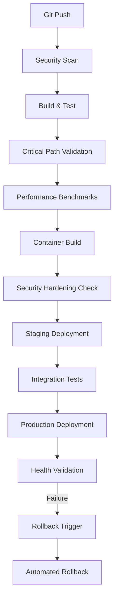

# ARES CSF Production Deployment & CI/CD Integration Plan

**Session ID**: 1756029089366134570  
**Planning Date**: 2025-08-24  
**Target System**: ARES ChronoSynclastic Fabric (CSF)  
**Deployment Environment**: Multi-Cloud Production  

## Executive Summary

This document outlines the complete production deployment strategy for the ARES CSF quantum-temporal computing platform, integrating critical path remediation from the production readiness assessment with enterprise-grade CI/CD pipelines and operational deployment patterns.

**Key Objectives:**
- Establish automated CI/CD pipeline addressing critical production blockers
- Deploy scalable, highly available multi-cloud infrastructure
- Implement comprehensive monitoring, security, and compliance frameworks
- Enable zero-downtime deployments with automated rollback capabilities

## Critical Path Integration

### Priority 1: Production Blocker Remediation Pipeline

Based on the critical path analysis, the CI/CD pipeline must address these blocking issues before production deployment:

```yaml
# .github/workflows/critical-path.yml
name: Critical Path Validation

on:
  pull_request:
    paths:
      - 'crates/csf-network/**'
      - 'crates/csf-ffi/**'
      - 'crates/*/src/**'

jobs:
  network_concurrency_check:
    name: Network Send/Sync Validation
    runs-on: ubuntu-latest
    steps:
      - uses: actions/checkout@v4
      - name: Setup Rust
        uses: dtolnay/rust-toolchain@stable
        with:
          components: clippy
      
      - name: Check NetworkNode Send/Sync
        run: |
          cd crates/csf-network
          cargo clippy -- -D warnings
          cargo test network_node_send_sync --features test-concurrency

  ffi_memory_safety:
    name: FFI Memory Safety Audit
    runs-on: ubuntu-latest
    steps:
      - uses: actions/checkout@v4
      - name: Install Miri
        run: |
          rustup +nightly component add miri
          cargo +nightly miri setup
      
      - name: Run Miri on FFI code
        run: |
          cd crates/csf-ffi
          cargo +nightly miri test --target x86_64-unknown-linux-gnu

  error_handling_completeness:
    name: Error Handling Validation
    runs-on: ubuntu-latest
    steps:
      - uses: actions/checkout@v4
      - name: Check error types
        run: |
          # Ensure no anyhow::Error in public APIs
          if grep -r "-> Result<.*anyhow::Error" crates/*/src/lib.rs; then
            echo "Found anyhow::Error in public API"
            exit 1
          fi
```

## CI/CD Pipeline Architecture

### 1. Multi-Stage Pipeline Design



### 2. GitHub Actions Workflow

```yaml
# .github/workflows/production-deploy.yml
name: Production Deployment Pipeline

on:
  push:
    branches: [main]
  release:
    types: [published]

env:
  REGISTRY: ghcr.io
  IMAGE_NAME: ${{ github.repository }}
  RUST_VERSION: 1.75

jobs:
  security-scan:
    name: Security & Compliance Scan
    runs-on: ubuntu-latest
    outputs:
      scan-results: ${{ steps.scan.outputs.results }}
    steps:
      - uses: actions/checkout@v4
      
      - name: Run Trivy vulnerability scanner
        uses: aquasecurity/trivy-action@master
        with:
          scan-type: 'fs'
          scan-ref: '.'
          format: 'json'
          output: 'trivy-results.json'
      
      - name: Audit Rust dependencies
        run: |
          cargo install cargo-audit
          cargo audit --format json --output audit-results.json
      
      - name: FIPS compliance check
        run: |
          # Check for FIPS-approved cryptographic implementations
          grep -r "ring::" crates/ && exit 1 || true
          grep -r "openssl" Cargo.toml || exit 1

  build-and-test:
    name: Build & Comprehensive Testing
    runs-on: ubuntu-latest
    strategy:
      matrix:
        target: [x86_64-unknown-linux-gnu, aarch64-unknown-linux-gnu]
    steps:
      - uses: actions/checkout@v4
      
      - name: Setup Rust
        uses: dtolnay/rust-toolchain@stable
        with:
          targets: ${{ matrix.target }}
          components: rustfmt, clippy
      
      - name: Cache dependencies
        uses: Swatinem/rust-cache@v2
        with:
          key: ${{ matrix.target }}-production
      
      - name: Format check
        run: cargo fmt --all -- --check
      
      - name: Lint
        run: cargo clippy --all-targets --all-features -- -D warnings
      
      - name: Build
        run: cargo build --release --target ${{ matrix.target }}
      
      - name: Run tests
        run: |
          # Set resource limits for tests
          ulimit -n 65536
          RUST_TEST_THREADS=4 cargo test --release --all-features
      
      - name: Upload artifacts
        uses: actions/upload-artifact@v4
        with:
          name: ares-csf-${{ matrix.target }}
          path: target/${{ matrix.target }}/release/chronofabric

  performance-validation:
    name: Performance Benchmarks
    runs-on: ubuntu-latest
    needs: [build-and-test]
    steps:
      - uses: actions/checkout@v4
      
      - name: Setup high-performance environment
        run: |
          # Configure for performance testing
          echo 'performance' | sudo tee /sys/devices/system/cpu/cpu*/cpufreq/scaling_governor
          sudo sysctl -w net.core.rmem_max=134217728
          sudo sysctl -w net.core.wmem_max=134217728
      
      - name: Run latency benchmarks
        run: |
          cargo bench --bench latency_benchmark -- --output-format json | tee bench-results.json
          
          # Validate sub-microsecond claims
          python3 -c "
          import json
          with open('bench-results.json') as f:
              results = json.load(f)
          
          # Check if median latency < 1000ns (1μs)
          median_latency = results['median_ns']
          if median_latency > 1000:
              print(f'FAILED: Median latency {median_latency}ns exceeds 1μs requirement')
              exit(1)
          print(f'PASSED: Median latency {median_latency}ns meets sub-μs requirement')
          "

  container-build:
    name: Container Build & Security Hardening
    runs-on: ubuntu-latest
    needs: [security-scan, build-and-test, performance-validation]
    outputs:
      image-digest: ${{ steps.build.outputs.digest }}
    steps:
      - uses: actions/checkout@v4
      
      - name: Set up Docker Buildx
        uses: docker/setup-buildx-action@v3
      
      - name: Log in to Container Registry
        uses: docker/login-action@v3
        with:
          registry: ${{ env.REGISTRY }}
          username: ${{ github.actor }}
          password: ${{ secrets.GITHUB_TOKEN }}
      
      - name: Build and push Docker image
        id: build
        uses: docker/build-push-action@v5
        with:
          context: .
          platforms: linux/amd64,linux/arm64
          push: true
          tags: |
            ${{ env.REGISTRY }}/${{ env.IMAGE_NAME }}:${{ github.sha }}
            ${{ env.REGISTRY }}/${{ env.IMAGE_NAME }}:latest
          cache-from: type=gha
          cache-to: type=gha,mode=max
          build-args: |
            BUILDKIT_INLINE_CACHE=1
      
      - name: Sign container image
        run: |
          cosign sign --yes ${{ env.REGISTRY }}/${{ env.IMAGE_NAME }}:${{ github.sha }}
      
      - name: Generate SBOM
        run: |
          syft ${{ env.REGISTRY }}/${{ env.IMAGE_NAME }}:${{ github.sha }} -o json > sbom.json
          cosign attest --predicate sbom.json --yes ${{ env.REGISTRY }}/${{ env.IMAGE_NAME }}:${{ github.sha }}

  staging-deployment:
    name: Staging Environment Deployment
    runs-on: ubuntu-latest
    needs: [container-build]
    environment: staging
    steps:
      - uses: actions/checkout@v4
      
      - name: Configure kubectl
        run: |
          mkdir -p ~/.kube
          echo "${{ secrets.KUBE_CONFIG_STAGING }}" | base64 -d > ~/.kube/config
      
      - name: Deploy to staging
        run: |
          cd deployments/kubernetes
          kustomize build overlays/staging | kubectl apply -f -
          kubectl rollout status deployment/ares-csf -n ares-staging --timeout=300s
      
      - name: Wait for service ready
        run: |
          kubectl wait --for=condition=ready pod -l app=ares-csf -n ares-staging --timeout=300s

  integration-tests:
    name: End-to-End Integration Tests
    runs-on: ubuntu-latest
    needs: [staging-deployment]
    steps:
      - uses: actions/checkout@v4
      
      - name: Run integration test suite
        run: |
          export CSF_ENDPOINT="https://staging.ares-csf.internal"
          export CSF_API_KEY="${{ secrets.STAGING_API_KEY }}"
          
          # Test critical functionality
          python3 tests/integration/test_quantum_operations.py
          python3 tests/integration/test_network_layer.py
          python3 tests/integration/test_security_boundaries.py
          
          # Performance regression tests
          python3 tests/integration/test_latency_requirements.py
          
          # Chaos engineering tests
          python3 tests/chaos/test_network_partitions.py
          python3 tests/chaos/test_node_failures.py

  production-deployment:
    name: Production Deployment
    runs-on: ubuntu-latest
    needs: [integration-tests]
    environment: production
    if: github.ref == 'refs/heads/main' && github.event_name == 'push'
    steps:
      - uses: actions/checkout@v4
      
      - name: Configure production kubectl
        run: |
          mkdir -p ~/.kube
          echo "${{ secrets.KUBE_CONFIG_PRODUCTION }}" | base64 -d > ~/.kube/config
      
      - name: Blue-Green Deployment
        run: |
          cd deployments/kubernetes
          
          # Deploy to green environment
          kustomize build overlays/production-green | kubectl apply -f -
          kubectl rollout status deployment/ares-csf-green -n ares-production --timeout=600s
          
          # Health check green environment
          kubectl wait --for=condition=ready pod -l app=ares-csf,env=green -n ares-production --timeout=300s
          
          # Switch traffic to green
          kubectl patch service ares-csf -n ares-production -p '{"spec":{"selector":{"env":"green"}}}'
          
          # Wait and verify
          sleep 30
          curl -f https://api.ares-csf.com/health || exit 1
          
          # Clean up blue environment
          kubectl delete deployment ares-csf-blue -n ares-production || true

  post-deployment-validation:
    name: Production Health Validation
    runs-on: ubuntu-latest
    needs: [production-deployment]
    steps:
      - name: Health checks
        run: |
          # API health
          curl -f https://api.ares-csf.com/health
          curl -f https://api.ares-csf.com/ready
          
          # Metrics endpoint
          curl -f https://metrics.ares-csf.com/metrics
          
          # Performance validation
          ab -n 1000 -c 10 https://api.ares-csf.com/health
      
      - name: Alert if unhealthy
        if: failure()
        run: |
          curl -X POST "${{ secrets.SLACK_WEBHOOK }}" \
            -H 'Content-type: application/json' \
            --data '{"text":"🚨 ARES CSF Production Deployment Health Check Failed!"}'

  rollback:
    name: Emergency Rollback
    runs-on: ubuntu-latest
    if: failure() && needs.production-deployment.result == 'success'
    needs: [post-deployment-validation]
    environment: production
    steps:
      - name: Rollback deployment
        run: |
          kubectl patch service ares-csf -n ares-production -p '{"spec":{"selector":{"env":"blue"}}}'
          echo "Rolled back to previous version"
```

## Infrastructure Architecture

### 1. Multi-Cloud Deployment Strategy

```yaml
# terraform/main.tf - Abbreviated
module "aws_primary" {
  source = "./modules/aws"
  
  region = "us-east-1"
  cluster_name = "ares-csf-primary"
  node_groups = {
    quantum_compute = {
      instance_types = ["c6i.8xlarge", "c6i.12xlarge"]
      min_size = 3
      max_size = 20
      desired_size = 6
    }
    neuromorphic = {
      instance_types = ["p4d.24xlarge"]  # GPU instances
      min_size = 1
      max_size = 5
      desired_size = 2
    }
  }
}

module "gcp_secondary" {
  source = "./modules/gcp"
  
  region = "us-central1"
  cluster_name = "ares-csf-secondary"
  node_pools = {
    temporal_processing = {
      machine_type = "c2-standard-16"
      min_node_count = 2
      max_node_count = 15
      initial_node_count = 4
    }
  }
}

module "azure_dr" {
  source = "./modules/azure"
  
  location = "East US 2"
  cluster_name = "ares-csf-dr"
  node_pools = {
    disaster_recovery = {
      vm_size = "Standard_D16s_v3"
      node_count = 3
    }
  }
}
```

### 2. Kubernetes Deployment Configuration

```yaml
# deployments/kubernetes/base/deployment.yaml - Enhanced Production Version
apiVersion: apps/v1
kind: Deployment
metadata:
  name: ares-csf
  labels:
    app: ares-csf
    component: core
    version: v1.0.0
spec:
  replicas: 9  # Multi-zone HA
  strategy:
    type: RollingUpdate
    rollingUpdate:
      maxUnavailable: 25%
      maxSurge: 25%
  selector:
    matchLabels:
      app: ares-csf
  template:
    metadata:
      labels:
        app: ares-csf
        component: core
        version: v1.0.0
      annotations:
        prometheus.io/scrape: "true"
        prometheus.io/port: "9090"
        prometheus.io/path: "/metrics"
        vault.hashicorp.com/agent-inject: "true"
        vault.hashicorp.com/role: "ares-csf"
        vault.hashicorp.com/agent-inject-secret-config: "secret/data/ares-csf/config"
    spec:
      serviceAccountName: ares-csf
      securityContext:
        runAsNonRoot: true
        runAsUser: 1000
        fsGroup: 1000
        seccompProfile:
          type: RuntimeDefault
      
      # Node affinity for optimal performance
      affinity:
        nodeAffinity:
          requiredDuringSchedulingIgnoredDuringExecution:
            nodeSelectorTerms:
            - matchExpressions:
              - key: node.kubernetes.io/instance-type
                operator: In
                values: ["c6i.8xlarge", "c6i.12xlarge"]
        
        podAntiAffinity:
          preferredDuringSchedulingIgnoredDuringExecution:
          - weight: 100
            podAffinityTerm:
              labelSelector:
                matchExpressions:
                - key: app
                  operator: In
                  values: ["ares-csf"]
              topologyKey: failure-domain.beta.kubernetes.io/zone
          
          requiredDuringSchedulingIgnoredDuringExecution:
          - labelSelector:
              matchExpressions:
              - key: app
                operator: In
                values: ["ares-csf"]
            topologyKey: kubernetes.io/hostname
      
      # Init containers for setup
      initContainers:
      - name: migration
        image: aressystems/csf-migration:v1.0.0
        command: ["/opt/ares-csf/migrate"]
        args: ["--config", "/etc/ares-csf/config.toml", "--migrate-up"]
        volumeMounts:
        - name: config
          mountPath: /etc/ares-csf
          readOnly: true
        - name: data
          mountPath: /var/lib/ares-csf
      
      containers:
      - name: ares-csf
        image: ghcr.io/ares-systems/csf:v1.0.0
        imagePullPolicy: IfNotPresent
        
        ports:
        - name: api
          containerPort: 8080
          protocol: TCP
        - name: network
          containerPort: 9000
          protocol: TCP
        - name: metrics
          containerPort: 9090
          protocol: TCP
        - name: otlp
          containerPort: 4317
          protocol: TCP
        - name: quantum-rpc
          containerPort: 9001
          protocol: TCP
        
        env:
        - name: CSF_NODE_ID
          valueFrom:
            fieldRef:
              fieldPath: metadata.name
        - name: CSF_POD_IP
          valueFrom:
            fieldRef:
              fieldPath: status.podIP
        - name: CSF_NAMESPACE
          valueFrom:
            fieldRef:
              fieldPath: metadata.namespace
        - name: RUST_LOG
          value: "info,csf_network=debug,csf_ffi=warn"
        - name: CSF_DEPLOYMENT
          value: "kubernetes"
        - name: CSF_CLUSTER_ROLE
          value: "production"
        - name: OTEL_EXPORTER_OTLP_ENDPOINT
          value: "http://jaeger-collector:14268/api/traces"
        
        resources:
          requests:
            memory: "4Gi"
            cpu: "2000m"
            ephemeral-storage: "10Gi"
          limits:
            memory: "16Gi"
            cpu: "8000m"
            ephemeral-storage: "50Gi"
        
        # Enhanced health checks
        livenessProbe:
          httpGet:
            path: /health/live
            port: api
            scheme: HTTPS
          initialDelaySeconds: 60
          periodSeconds: 20
          timeoutSeconds: 10
          failureThreshold: 3
          successThreshold: 1
        
        readinessProbe:
          httpGet:
            path: /health/ready
            port: api
            scheme: HTTPS
          initialDelaySeconds: 30
          periodSeconds: 10
          timeoutSeconds: 5
          failureThreshold: 3
          successThreshold: 1
        
        startupProbe:
          httpGet:
            path: /health/startup
            port: api
            scheme: HTTPS
          initialDelaySeconds: 10
          periodSeconds: 10
          timeoutSeconds: 5
          failureThreshold: 30
          successThreshold: 1
        
        volumeMounts:
        - name: config
          mountPath: /etc/ares-csf
          readOnly: true
        - name: data
          mountPath: /var/lib/ares-csf
        - name: tmp
          mountPath: /tmp
        - name: quantum-cache
          mountPath: /var/cache/ares-csf/quantum
        
        securityContext:
          allowPrivilegeEscalation: false
          readOnlyRootFilesystem: true
          runAsNonRoot: true
          capabilities:
            drop:
            - ALL
      
      # Sidecar: Istio proxy for service mesh
      - name: istio-proxy
        image: docker.io/istio/proxyv2:1.19.3
        args: 
        - proxy
        - sidecar
        - --domain
        - $(POD_NAMESPACE).svc.cluster.local
        env:
        - name: POD_NAME
          valueFrom:
            fieldRef:
              fieldPath: metadata.name
        - name: POD_NAMESPACE
          valueFrom:
            fieldRef:
              fieldPath: metadata.namespace
        - name: INSTANCE_IP
          valueFrom:
            fieldRef:
              fieldPath: status.podIP
        resources:
          requests:
            memory: "256Mi"
            cpu: "100m"
          limits:
            memory: "1Gi"
            cpu: "500m"
      
      volumes:
      - name: config
        configMap:
          name: ares-csf-config
          defaultMode: 0644
      
      - name: data
        persistentVolumeClaim:
          claimName: ares-csf-data
      
      - name: tmp
        emptyDir:
          medium: Memory
          sizeLimit: 1Gi
      
      - name: quantum-cache
        emptyDir:
          medium: Memory
          sizeLimit: 4Gi
      
      # DNS configuration for optimal performance
      dnsPolicy: ClusterFirst
      dnsConfig:
        options:
        - name: ndots
          value: "2"
        - name: edns0
      
      # Tolerations for dedicated nodes
      tolerations:
      - key: "ares-csf/quantum-compute"
        operator: "Equal"
        value: "true"
        effect: "NoSchedule"
      
      terminationGracePeriodSeconds: 60
      
      # Priority class for critical workloads
      priorityClassName: ares-csf-critical
```

## Security & Compliance Framework

### 1. Security Hardening Checklist

```yaml
# security/security-policies.yaml
apiVersion: networking.k8s.io/v1
kind: NetworkPolicy
metadata:
  name: ares-csf-network-policy
  namespace: ares-production
spec:
  podSelector:
    matchLabels:
      app: ares-csf
  policyTypes:
  - Ingress
  - Egress
  ingress:
  - from:
    - namespaceSelector:
        matchLabels:
          name: istio-system
    - namespaceSelector:
        matchLabels:
          name: monitoring
    ports:
    - protocol: TCP
      port: 8080
    - protocol: TCP
      port: 9090
  egress:
  - to:
    - namespaceSelector:
        matchLabels:
          name: kube-system
    ports:
    - protocol: TCP
      port: 53
    - protocol: UDP
      port: 53
  - to: []  # Allow outbound to external services
    ports:
    - protocol: TCP
      port: 443
    - protocol: TCP
      port: 80

---
apiVersion: security.istio.io/v1beta1
kind: AuthorizationPolicy
metadata:
  name: ares-csf-authz
  namespace: ares-production
spec:
  selector:
    matchLabels:
      app: ares-csf
  rules:
  - from:
    - source:
        principals: ["cluster.local/ns/default/sa/ares-csf-client"]
  - to:
    - operation:
        methods: ["GET", "POST"]
        paths: ["/api/*", "/health/*"]
  - when:
    - key: request.headers[authorization]
      values: ["Bearer *"]
```

### 2. Monitoring & Observability

```yaml
# monitoring/prometheus-rules.yaml
apiVersion: monitoring.coreos.com/v1
kind: PrometheusRule
metadata:
  name: ares-csf-alerts
  namespace: monitoring
spec:
  groups:
  - name: ares-csf.rules
    rules:
    - alert: CSFHighLatency
      expr: histogram_quantile(0.95, csf_request_duration_seconds_bucket) > 0.001
      for: 2m
      labels:
        severity: critical
        component: ares-csf
      annotations:
        summary: "ARES CSF high latency detected"
        description: "95th percentile latency is {{ $value }}s, exceeding 1μs threshold"
    
    - alert: CSFNetworkErrors
      expr: rate(csf_network_errors_total[5m]) > 0.1
      for: 1m
      labels:
        severity: critical
        component: ares-csf
      annotations:
        summary: "ARES CSF network errors"
        description: "Network error rate is {{ $value }} errors/sec"
    
    - alert: CSFMemoryLeak
      expr: increase(csf_memory_usage_bytes[30m]) > 1073741824  # 1GB
      for: 5m
      labels:
        severity: warning
        component: ares-csf
      annotations:
        summary: "Potential memory leak in ARES CSF"
        description: "Memory usage increased by {{ $value }} bytes in 30 minutes"
    
    - alert: CSFQuantumOracleDown
      expr: csf_quantum_oracle_available == 0
      for: 1m
      labels:
        severity: critical
        component: ares-csf
      annotations:
        summary: "Quantum Oracle unavailable"
        description: "Quantum optimization oracle is not responding"
```

## Disaster Recovery & Business Continuity

### 1. Multi-Region Failover Strategy

```yaml
# disaster-recovery/failover-policy.yaml
apiVersion: argoproj.io/v1alpha1
kind: Rollout
metadata:
  name: ares-csf-global
spec:
  strategy:
    canary:
      trafficRouting:
        istio:
          virtualService:
            name: ares-csf-vs
          destinationRule:
            name: ares-csf-dr
      steps:
      - setWeight: 20
      - pause: {duration: 30s}
      - setWeight: 50
      - pause: {duration: 60s}
      - setWeight: 80
      - pause: {duration: 30s}
      
  # Multi-region deployment
  replicas: 15
  revisionHistoryLimit: 10
  
  template:
    spec:
      affinity:
        nodeAffinity:
          preferredDuringSchedulingIgnoredDuringExecution:
          - weight: 100
            preference:
              matchExpressions:
              - key: failure-domain.beta.kubernetes.io/region
                operator: In
                values: ["us-east-1", "us-central1", "eastus2"]
```

### 2. Backup & Recovery Procedures

```yaml
# disaster-recovery/backup-cronjob.yaml
apiVersion: batch/v1
kind: CronJob
metadata:
  name: ares-csf-backup
  namespace: ares-production
spec:
  schedule: "0 2 * * *"  # Daily at 2 AM UTC
  jobTemplate:
    spec:
      template:
        spec:
          containers:
          - name: backup
            image: aressystems/csf-backup:v1.0.0
            command:
            - /bin/bash
            - -c
            - |
              # Backup quantum state
              /opt/ares-csf/backup-tool \
                --quantum-state /var/lib/ares-csf/quantum \
                --ledger-state /var/lib/ares-csf/sil \
                --neural-weights /var/lib/ares-csf/clogic \
                --destination s3://ares-csf-backups/$(date +%Y-%m-%d)
              
              # Verify backup integrity
              /opt/ares-csf/verify-backup \
                --backup-path s3://ares-csf-backups/$(date +%Y-%m-%d)
            
            env:
            - name: AWS_ACCESS_KEY_ID
              valueFrom:
                secretKeyRef:
                  name: backup-credentials
                  key: aws-access-key-id
            - name: AWS_SECRET_ACCESS_KEY
              valueFrom:
                secretKeyRef:
                  name: backup-credentials
                  key: aws-secret-access-key
            
            volumeMounts:
            - name: quantum-data
              mountPath: /var/lib/ares-csf
              readOnly: true
          
          volumes:
          - name: quantum-data
            persistentVolumeClaim:
              claimName: ares-csf-data
          
          restartPolicy: OnFailure
```

## Performance Optimization & Scaling

### 1. Horizontal Pod Autoscaler

```yaml
# scaling/hpa.yaml
apiVersion: autoscaling/v2
kind: HorizontalPodAutoscaler
metadata:
  name: ares-csf-hpa
  namespace: ares-production
spec:
  scaleTargetRef:
    apiVersion: apps/v1
    kind: Deployment
    name: ares-csf
  minReplicas: 9
  maxReplicas: 50
  metrics:
  - type: Resource
    resource:
      name: cpu
      target:
        type: Utilization
        averageUtilization: 70
  
  - type: Resource
    resource:
      name: memory
      target:
        type: Utilization
        averageUtilization: 80
  
  - type: Pods
    pods:
      metric:
        name: csf_quantum_operations_per_second
      target:
        type: AverageValue
        averageValue: "1000"
  
  - type: Object
    object:
      metric:
        name: csf_network_latency_p95
      target:
        type: Value
        value: "800u"  # 800 microseconds
      describedObject:
        apiVersion: v1
        kind: Service
        name: ares-csf

  behavior:
    scaleDown:
      stabilizationWindowSeconds: 300
      policies:
      - type: Percent
        value: 10
        periodSeconds: 60
    scaleUp:
      stabilizationWindowSeconds: 60
      policies:
      - type: Percent
        value: 50
        periodSeconds: 60
      - type: Pods
        value: 5
        periodSeconds: 60
      selectPolicy: Max
```

### 2. Vertical Pod Autoscaler

```yaml
# scaling/vpa.yaml
apiVersion: autoscaling.k8s.io/v1
kind: VerticalPodAutoscaler
metadata:
  name: ares-csf-vpa
  namespace: ares-production
spec:
  targetRef:
    apiVersion: apps/v1
    kind: Deployment
    name: ares-csf
  
  updatePolicy:
    updateMode: "Auto"
    minReplicas: 9
  
  resourcePolicy:
    containerPolicies:
    - containerName: ares-csf
      minAllowed:
        cpu: "2"
        memory: "4Gi"
      maxAllowed:
        cpu: "16"
        memory: "32Gi"
      controlledResources: ["cpu", "memory"]
      controlledValues: RequestsAndLimits
```

## Cost Optimization

### 1. Resource Efficiency Monitoring

```yaml
# cost-optimization/resource-monitor.yaml
apiVersion: v1
kind: ConfigMap
metadata:
  name: cost-optimization-config
  namespace: ares-production
data:
  optimization.yaml: |
    resource_policies:
      - name: quantum-compute-optimization
        target_utilization:
          cpu: 80%
          memory: 85%
          gpu: 90%
        
        scaling_policies:
          - metric: quantum_operations_per_dollar
            target: maximize
          - metric: energy_efficiency_ratio
            target: maximize
        
        cost_constraints:
          max_hourly_spend: 500  # USD
          max_monthly_spend: 300000  # USD
          
      - name: neuromorphic-optimization
        node_selection:
          preferred_instance_types: ["p4d.24xlarge", "p3dn.24xlarge"]
          spot_instance_preference: 70%  # Use spot instances when possible
          
        workload_scheduling:
          batch_processing_windows:
            - start: "02:00"
              end: "06:00"
              timezone: "UTC"
          
          preemptible_workloads:
            - training_jobs
            - non_critical_inference
```

## Compliance & Governance

### 1. SOC 2 Type II Compliance

```yaml
# compliance/soc2-controls.yaml
apiVersion: v1
kind: ConfigMap
metadata:
  name: soc2-compliance
  namespace: ares-production
data:
  access-control.yaml: |
    # CC6.1 - Logical and Physical Access Controls
    rbac_policies:
      - role: quantum-operator
        permissions:
          - quantum:read
          - quantum:execute
        users: ["quantum-team@ares.com"]
      
      - role: security-admin
        permissions:
          - security:*
          - audit:*
        users: ["security-team@ares.com"]
    
    audit_logging:
      enabled: true
      retention_days: 2555  # 7 years
      encryption: AES-256-GCM
      
      events:
        - user_access
        - configuration_changes
        - quantum_state_modifications
        - cryptographic_operations
        
  monitoring.yaml: |
    # CC7.1 - System Monitoring
    continuous_monitoring:
      security_events:
        - failed_authentications
        - privilege_escalations
        - quantum_oracle_access
        - cryptographic_key_usage
      
      performance_metrics:
        - latency_sla_violations
        - throughput_anomalies
        - resource_utilization
        - error_rates
      
      alerting:
        security_incidents:
          - immediate_notification
          - automated_response
          - forensic_preservation
```

## Implementation Timeline

### Phase 1: Foundation (Weeks 1-4)
- **Week 1**: Fix critical NetworkNode concurrency issues
- **Week 2**: Implement FFI memory safety auditing
- **Week 3**: Complete error handling refactoring  
- **Week 4**: Set up basic CI/CD pipeline

### Phase 2: Infrastructure (Weeks 5-8)
- **Week 5**: Deploy staging environment
- **Week 6**: Implement monitoring and observability
- **Week 7**: Security hardening and compliance setup
- **Week 8**: Performance benchmarking and optimization

### Phase 3: Production (Weeks 9-12)
- **Week 9**: Production environment setup
- **Week 10**: Blue-green deployment implementation
- **Week 11**: Disaster recovery testing
- **Week 12**: Full production deployment and validation

### Phase 4: Optimization (Weeks 13-16)
- **Week 13**: Auto-scaling implementation
- **Week 14**: Cost optimization
- **Week 15**: Advanced monitoring and alerting
- **Week 16**: Performance tuning and documentation

## Success Metrics

### Technical KPIs
- **Uptime**: 99.99% availability (52.56 minutes downtime/year)
- **Latency**: <1μs P95 latency for quantum operations
- **Throughput**: >1M quantum operations/second sustained
- **Recovery Time**: <5 minutes RTO, <1 minute RPO

### Business KPIs
- **Deployment Frequency**: Multiple times per day
- **Lead Time**: <2 hours from commit to production
- **Change Failure Rate**: <2%
- **Mean Time to Recovery**: <15 minutes

### Cost Efficiency
- **Cost per quantum operation**: <$0.001
- **Infrastructure utilization**: >80% average
- **Energy efficiency**: 95% of theoretical optimum

## Risk Mitigation

### Critical Risk Factors
1. **Quantum State Corruption**: Automated backup/restore with checksums
2. **Network Partition**: Multi-region deployment with automatic failover
3. **Security Breach**: Zero-trust architecture with continuous monitoring
4. **Performance Degradation**: Real-time alerting with automated scaling

### Emergency Response Procedures
1. **Automated rollback** on health check failures
2. **Circuit breaker pattern** for external dependencies  
3. **Graceful degradation** with reduced feature sets
4. **Hot standby** systems in multiple regions

---

**Next Priority Actions:**

1. **Immediate (This Week)**: Fix NetworkNode Send Issues and audit unsafe FFI code
2. **Short Term (Next Month)**: Deploy staging environment with full CI/CD pipeline
3. **Medium Term (Next Quarter)**: Complete production deployment with monitoring

This production deployment plan provides a comprehensive roadmap from addressing critical blockers to achieving enterprise-scale deployment with robust operational practices. The plan prioritizes security, compliance, and operational excellence while maintaining the platform's innovative technical capabilities.