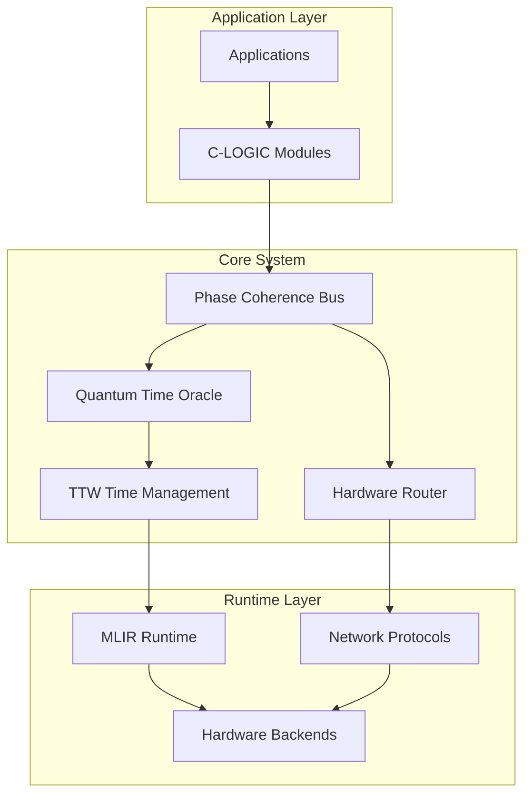

# Welcome to ARES ChronoFabric

import Tabs from '@theme/Tabs';
import TabItem from '@theme/TabItem';

**ARES ChronoFabric** is a revolutionary quantum temporal correlation system for distributed computing that achieves sub-microsecond latency and million+ messages/second throughput.

## 🎯 What is ARES ChronoFabric?

ARES ChronoFabric is a production-grade Rust implementation that provides:

- **Sub-microsecond latency** (<1μs) for critical message paths
- **Million+ messages/second** throughput on single nodes  
- **Hardware-accelerated routing** with SIMD optimization
- **Quantum-inspired temporal optimization** for predictive scheduling
- **Zero-copy message passing** with production-grade thread safety
- **Advanced cognitive computing** through C-LOGIC modules

## 🚀 Production Status

:::tip Production Ready
The ARES ChronoFabric system has achieved production-grade status with full compilation and testing validation. The system is ready for deployment in demanding distributed computing environments.
:::

## 🏗️ Architecture Overview

## 📚 Quick Navigation

<Tabs>
<TabItem value="getting-started" label="🚀 Getting Started">

Start your journey with ARES ChronoFabric:

- [Installation Guide](./installation) - Set up your development environment
- [Quick Start](./quick-start) - Build and run your first example
- [Configuration](./configuration) - Configure the system for your needs

</TabItem>
<TabItem value="architecture" label="🏗️ Architecture">

Understand the system architecture:

- [System Overview](./architecture/overview) - High-level system design
- [Core Components](./architecture/core-components) - Essential building blocks
- [Quantum Time Oracle](./architecture/quantum-time-oracle) - Time management system

</TabItem>
<TabItem value="development" label="💻 Development">

Start developing with ARES ChronoFabric:

- [Contributing Guide](./development/contributing) - How to contribute
- [Coding Standards](./development/coding-standards) - Code quality guidelines
- [Testing](./development/testing) - Testing strategies and tools

</TabItem>
</Tabs>

## 🔧 Key Features

### Temporal Coherence
All operations maintain causality through Hybrid Logical Clocks (HLC) with femtosecond precision.

### Zero-Copy Architecture
Memory-efficient message passing with `Arc<T>` shared ownership for optimal performance.

### Hardware Acceleration
SIMD-optimized routing with TSC timing calibration for maximum throughput.

### Type Safety
Compile-time guarantees with runtime dynamic dispatch support for reliable operation.

## 📖 Documentation Sections

| Section | Description |
|---------|-------------|
| **[System Architecture](./architecture/overview)** | Comprehensive system design and components |
| **[API Reference](./api/overview)** | Complete API documentation for all crates |
| **[Architecture Decisions](./adr/overview)** | Decision records and technical rationale |
| **[Performance Guide](./guides/performance-troubleshooting)** | Optimization and troubleshooting |
| **[Strategic Roadmap](./reference/strategic-roadmap)** | 22-week implementation timeline |

## 🎯 Core Design Principles

1. **One Bus, One Scheduler, One Config** - Simplified architecture for reliability
2. **Deterministic Execution** - Predictable behavior for critical systems
3. **Production Safety** - Comprehensive error handling and monitoring
4. **Hardware Utilization** - Optimal use of modern CPU architectures
5. **Cognitive Integration** - Advanced AI/ML capabilities through C-LOGIC

## 🤝 Community

- **GitHub**: [ARES ChronoFabric Repository](https://github.com/1onlyadvance/CSF)
- **Author**: Ididia Serfaty
- **License**: MIT OR Apache-2.0

---

Ready to explore the future of distributed computing? Start with our [Installation Guide](./installation) or dive into the [System Architecture](./architecture/overview).